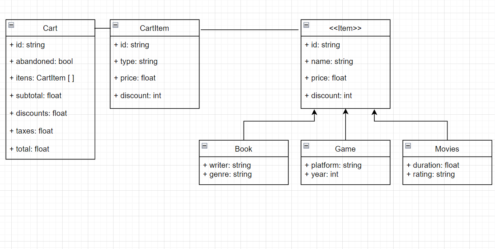

# HerokuShop

This project was used to build an API available through [Express](https://www.npmjs.com/package/express) to manage an online service store, featuring item classes and a cart creation and management. It was the pattern [Adapter](https://refactoring.guru/pt-br/design-patterns/adapter) to decouple the use of ORM SQL libraries, here being available the library [Sequelize](https://www.npmjs.com/package/sequelize).

The design patterns [FactoryMethod](https://refactoring.guru/pt-br/design-patterns/factory-method) and [Facade](https://refactoring.guru/pt-br/design-) were also used. The concept of [Dependency Injection](https://martinfowler.com/articles/injection.html) was applied. In addition, it was developed with [Automated Tests](https://www.davidbaumgold.com/tutorials/automated-tests-node/) using the [Jest](https://jestjs.io/pt-BR/) library for the creation, simulation and execution of tests.

The project also has a log service using [Winston](https://www.npmjs.com/package/winston) and [Elasticsearch](https://www.elastic.co/pt/whatis/elasticsearch), being possible to view the logs through [Kibana](https://www.elastic.co/pt/kibana/). Both are available for Api through [Docker](https://www.docker.com/).

# Technologies

The project uses the following technologies:
[NodeJs](https://nodejs.org/en/)
[Ts-Node](https://github.com/TypeStrong/ts-node)
[Typescript](https://www.typescriptlang.org/)
[Express](https://www.npmjs.com/package/express)
[Cors](https://www.npmjs.com/package/cors)
[Winston](https://www.npmjs.com/package/winston)
[Jest](https://jestjs.io/pt-BR/)
[Ts-Jest](https://github.com/kulshekhar/ts-jest)
[Sequelize](https://www.npmjs.com/package/sequelize)
[MySQL](https://www.mysql.com/)
[Eslint](https://eslint.org/)
[Express-Rate-Limit](https://www.npmjs.com/package/express-rate-limit),
[http-status-codes](https://www.npmjs.com/package/http-status-codes),
[Husky](https://www.npmjs.com/package/husky)
[Elasticsearch](https://www.elastic.co/pt/what-is/elasticsearch)
[Kibana](https://www.elastic.co/pt/kibana/)
[Docker](https://www.docker.com/)


# Installation local environment

- Make Elasticsearch, Kibana and MySQL services available

```
  $ docker-compose up -d
```
- You might need to free more space on docker to run Elastic,
in this case ( for WSL ) use the command below and restart the container:
```
  $  wsl -d docker-desktop
  $  sysctl -w vm.max_map_count=262144
```

- Configure MySQL with a database, user and password. Add this information in config/dev.env . Create the tables for each class. To do that you may find useful: [MySQL Tables](./markdown/mysqltables.md)

- To install all project dependencies

```
  $ npm install
```

- To run the project in local environment

```
  $ npm run dev
```

A API se encontrará disponível na porta **8080**

# Use

## Routes

----
- [/book](./markdown/book.md)
- [/movie](./markdown/movie.md)
- [/game](./markdown/game.md)
- [/cart](./markdown/cart.md)

---
</br>

# Database / Classes Diagram
---



- Main scripts used to create tables : [MySQL Tables](./markdown/mysqltables.md)